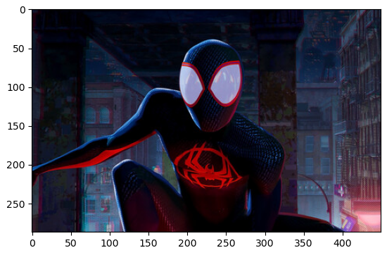
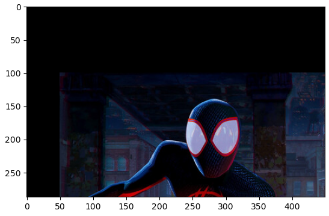
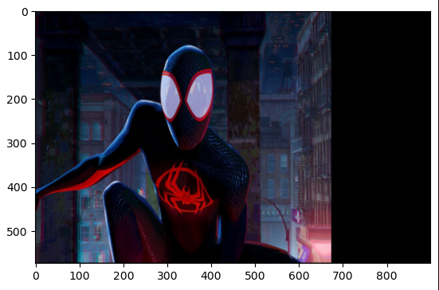
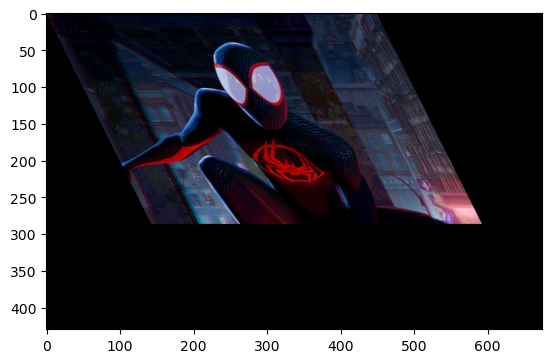
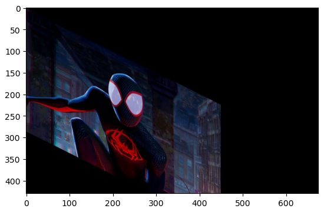
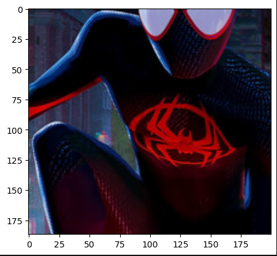

# IMAGETRANSFORMATION

## Aim
To perform image transformation such as Translation, Scaling, Shearing, Reflection, Rotation and Cropping using OpenCV and Python.

## Software Required:
Anaconda - Python 3.7

## Algorithm:
### Step1:
Translate the image.
### Step2:
Scale the image.
### Step3:
Shear the image.
### Step4:
Reflect of image.
### Step5:
Rotate the image.

## Program:
```
Developed By: Ronick Aakshath P
Register Number: 212222240084
```
```
import cv2
import numpy as np
img = cv2.imread('spider.pngg',-1)
original = cv2.cvtColor(img , cv2.COLOR_BGR2RGB)
cv2.imshow('input',original)
cv2.waitKey(0)
cv2.destroyAllWindows()
original.shape
row, col, dim = original.shape
```
i)Image Translation
```
translation = np.float32([[1,0,100],[0,1,150],[0,0,1]])
translated_image = cv2.warpPerspective(original,translation,(col,row))
cv2.imshow('translated_image',translated_image)
cv2.waitKey(0)
cv2.destroyAllWindows()
```
ii)Image shearing
```
shear_x = np.float32([[1,0.7,0],[0,1,0],[0,0,1]])
shear_y = np.float32([[1,0,0],[0.3,1,0],[0,0,1]])
sheared_x= cv2.warpPerspective(original,shear_x,(col,row))
sheared_y = cv2.warpPerspective(original,shear_y,(col,row))
cv2.imshow('shear_x',sheared_x)
cv2.waitKey(0)
cv2.destroyAllWindows()
cv2.imshow('shear_y',sheared_y)
cv2.waitKey(0)
cv2.destroyAllWindows()
```
iii)Image Reflection
```
ref_x = np.float32([[1,0,0],[0,-1,row],[0,0,1]])
ref_y = np.float32([[-1,0,col],[0,1,0],[0,0,1]])
reflect_x= cv2.warpPerspective(original,ref_x,(col,row))
reflect_y = cv2.warpPerspective(original,ref_y,(col,row))
cv2.imshow('reflected_x',reflect_x)
cv2.waitKey(0)
cv2.destroyAllWindows()
cv2.imshow('reflected_y',reflect_y)
cv2.waitKey(0)
cv2.destroyAllWindows()
```
iv)Image Rotation
```
angle = np.radians(15)
mat_rotate = np.float32([[np.cos(angle),-
(np.sin(angle)),0],[np.sin(angle),np.cos(angle),0],[0,0,1]])
rotate_img =cv2.warpPerspective(original,mat_rotate,(col,row))
cv2.imshow('rotated',rotate_img)
cv2.waitKey(0)
cv2.destroyAllWindows()
```
v)Image Cropping
```
cropped_img=img[10:500,25:600] 
cv2.imshow('after_cropping',cropped_img);
cv2.waitKey(0)
cv2.destroyAllWindows()
```
## Output:
### Original Image

### i)Image Translation

### ii) Image Scaling

### iii)Image shearing




### v)Image Rotation

### vi)Image Cropping


## Result: 

Thus the different image transformations such as Translation, Scaling, Shearing, Reflection, Rotation and Cropping are done using OpenCV and python programming.
